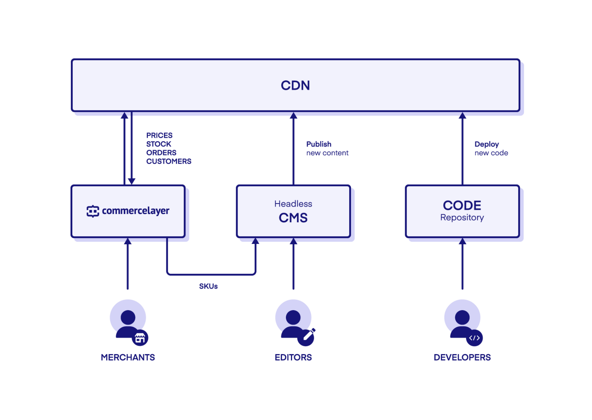

# Jamstack eCommerce 101

Digital commerce has changed, and there is an increasing demand for faster and kite efficient solutions. In this workshop, you'll learn about the evolution of ecommerce and how Jamstack and headless commerce evolves shopping experiences on the web. We will explore the basics of headless commerce by building a minimal Jamstack ecommerce product page with static content, HTML5, CSS, and Javascript. Finally, we will integrate Commerce Layer for headless commerce capabilities and deploy our application to Netlify.


## Table of content

1. [Prerequisites]()
2. [Workshop goals]()
3.

---

## Prerequisites

Some HTML, JavaScript, and command-line knowledge are required. An understanding of how APIs work would be helpful but not required. Also, you should have your favorite IDE and Git installed.

## Workshop goals

At the end of this workshop, you should be able to:

- Explain what traditional ecommerce means.
- Explain the challenges faced with traditional commerce.
- Explain what headless commerce means.
- Explain the benefits of headless commerce.
- Explain what Jamstack entails.
- Explain what Commerce Layer is and does.
- Understand how to use Commerce Layer dashboard.
- Understand how to use Commerce Layer CLI.
- Understand the available Commerce Layer commerce APIs.
- Understand how to use Commerce Layer JS SDK.
- Understand how Commerce Layer works in a headless architecture.
- Understand Commerce Layer checkout application (maybe).
- Understand how to deploy a static Jamstack project to Netlify.
- Understand the benefits of Commerce Layer in modern e-commerce.

## Quick introduction to headless commerce

Headless commerce is a new approach that solves all the challenges in traditional commerce. This approach decouples components, as seen in the monolithic ecommerce application, into independent modules. Hence, the frontend layer (the head) is separated from the backend, allowing more flexibility, better performance, and efficient development.

With the headless approach, developers independently build the presentation layer, backend (business logic), database layer, integrations and utilize the various headless commerce API solutions. Since the presentation layer is decoupled from the backend, developers can serve omnichannel experiences to users on several platforms with the same code and content. One great advantage of the headless commerce approach is deploying changes frequently, with little or no work required on the backend and no interruption to the customer experience.


## Quick introduction to Commerce Layer

Commerce Layer is a headless commerce platform and order management system that lets you add global shopping capabilities to any website, mobile app, chatbot, or IoT device, with ease. Perfect fit for the best-of-breed CMSs, static site generators, and any other tools you already master and love, our blazing-fast and secure API will help you make your content shoppable, on a global scale.



## Quick demo of what we'll build

We'll transform a plain HTML page into an enterprise-grade static commerce website with static content, HTML5, CSS, and Javascript. Finally, we will integrate Commerce Layer for headless commerce capabilities and deploy our application to Netlify.

GIF here


## Setup project directory

1. Create an `index.html` file in the root directory.
2. Create a `/css` directory and a `custom.css` file in it.
3. Create a `/src` directory and a `main.js` file in it.

We'll add more files as we proceed 😉.

## Install required packages

1. Run the `npm init` command and initialize a `package.json` file.
2. Copy and paste this into the `package.json` file:

```json
{
  "name": "CL Static Commerce Demo",
  "version": "1.0.0",
  "description": "",
  "main": "./dist/commercelayer.min.js",
  "scripts": {
    "start": "rm -rf ./dist && webpack --progress --watch --mode=development",
    "build": "rm -rf ./dist && webpack --progress"
  },
  "repository": {
    "type": "git",
    "url": "git+https://github.com/BolajiAyodeji/cl-jamstack-ecommerce-workshop.git"
  },
  "keywords": ["commerce layer", "jamstack", "headless", "ecommerce", "api"],
  "license": "MIT",
  "bugs": {
    "url": "https://github.com/BolajiAyodeji/cl-jamstack-ecommerce-workshop/issues"
  },
  "homepage": "https://github.com/BolajiAyodeji/cl-jamstack-ecommerce-workshop#readme",
  "dependencies": {
    "@commercelayer/js-auth": "^2.0.2",
    "@commercelayer/js-sdk": "^2.14.3",
    "js-cookie": "^2.2.1",
    "lodash": "^4.17.20"
  },
  "devDependencies": {
    "@babel/core": "^7.11.6",
    "@babel/plugin-proposal-object-rest-spread": "^7.11.0",
    "@babel/plugin-transform-runtime": "^7.11.5",
    "@babel/preset-env": "^7.11.5",
    "babel-loader": "^8.1.0",
    "clean-webpack-plugin": "^3.0.0",
    "html-webpack-plugin": "^4.5.0",
    "webpack": "^4.44.2",
    "webpack-cli": "^3.3.12",
    "webpack-dev-server": "^3.11.0"
  }
}
```

3. Now run `npm install` to install all packages in the `package.json` file.

## Setup webpack

We would be having multiple JavaScript files with modules and all. So we need to compile them all into one minified JS file we can drop into our `index.html` file.

To do this, we need to setup webpack, babel and some plugins (which you've installed already from the previous step). Kindly create a `webpack.config.js` file which will contain the configuration and paste the code below:

```js
const path = require("path");
const HtmlWebpackPlugin = require("html-webpack-plugin");
const { CleanWebpackPlugin } = require("clean-webpack-plugin");

module.exports = {
  entry: "./src/main.js",
  devtool: "source-map",
  output: {
    filename: "commercelayer.min.js",
    path: path.resolve(__dirname, "dist"),
  },
  resolve: {
    extensions: [".ts", ".js", ".json"],
    modules: ["node_modules", path.resolve(__dirname, "src")],
    symlinks: false,
  },
  devServer: {
    https: true,
    compress: true,
    port: 9000,
  },
  module: {
    rules: [
      {
        test: /\.m?(js|ts)$/,
        exclude: /node_modules/,
        use: [
          {
            loader: "babel-loader",
            options: {
              presets: ["@babel/preset-env"],
              plugins: ["@babel/plugin-proposal-object-rest-spread"],
            },
          },
        ],
      },
    ],
  },
  plugins: [
    new CleanWebpackPlugin(),
    new HtmlWebpackPlugin({
      template: "index.html",
    }),
  ],
};
```

We can now add the `commercelayer.min.js` to the bottom section of the `index.html` file like so:

```
<script type="text/javascript" src="./dist/commercelayer.min.js"></script>
```

## Setup Commerce Layer developer account

1. Head to [https://core.commercelayer.io/users/sign_up](https://core.commercelayer.io/users/sign_up) to create a free developer account.
2. Create a new [organization](https://commercelayer.io/docs/data-model/users-and-organizations/) for your business.
3. You can decide to seed your organization with test data manually or wait for the next section where I show you how to do that with the CLI.
4. If you skipped the seeding, you'll be prompted to complete a checklist of items because your organization requires a market and something to sell before you get the first order.

## Setting up [Commerce Layer CLI](https://github.com/commercelayer/commercelayer-cli)

The official Commerce Layer CLI which helps you to manage your Commerce Layer applications right from the terminal.

1. Run the command below to install the CLI using your favorite package manager:

```bash
npm install -g @commercelayer/commercelayer-cli
```

```bash
yarn global add @commercelayer/commercelayer-cli

```

Installing the CLI provides access to the commercelayer, clayer, and cl command.

2. In your Commerce Layer dashboard, head to **Settings > Applications** and create two applications with the following `name` and `kind` values respectively: Website, sales_chanel and CLI, cli (`kind` determines the authentication flow and set of permissions of the application).

> Upon a succesful creation, you'll get a _CREDENTIALS_ section added to the application with `CLIENT ID` and `ENDPOINT` for the _sales_channel_ and `CLIENT ID`, `CLIENT SECRET` and `ENDPOINT` for the _cli_. We'll use this to interact with our application later.

3. Login to your application via the CLI using the previously created CLI credentials like so:

```bash
commercelayer app:login -o <organizationSlug> -i <clientId> -s <clientSecret>
```

## Seed organization with test data using the CLI

Like I mentioned earlier, you can seed your organization with a set of products (SKUs), related prices, and inventory via the CLI.

1. Install the seeder plugin using the command below:

```bash
commercelayer plugins:install seeder
```

2. Generate an access token for your application using the command below:

```bash
commercelayer app:token
```

2. Seed your organization using the command below:

```bash
cl seed
```

The CLI will use Commerce Layer's [default seed](https://data.commercelayer.app/seed) as your `resourcesUrl`. If you want to seed with your own resources, you can pass the URL like so:

```bash
cl seed -u <resourcesUrl> | <seedUrl>
```

## Build product page structure

Now let's build our product page with the product details, fetch prices, available variants, available quantity, and availability of the item.

### Setup required configuration

Add the code below to `index.html` and add the required secrets:

```html
<!-- Config -->
<div
  id="clayer-config"
  data-base-url="<yourOrganizationUrl>"
  data-cache="true"
  data-client-id="<yourClientId>"
  data-market-id="<yourMarketId>"
  data-country-code="US"
  data-language-code="en"
  data-cart-url="https://example.com/cart"
  data-return-url="https://example.com/return"
  data-privacy-url="https://example.com/privacy"
  data-terms-url="https://example.com/terms"
  data-dev-settings-debug="true"
  data-dev-settings-console="true"
  data-dev-settings-trace="true"
></div>
```

Create a `config.js` file in `src` directory and add the code below:

```js
const clayerConfig = document.querySelector("#clayer-config");

let config = {
  baseUrl: "",
  clientId: "",
  marketId: "",
  countryCode: "",
  languageCode: "",
  cartUrl: "",
  returnUrl: "",
  privacyUrl: "",
  termsUrl: "",
  devSettings: {
    debug: "",
    console: "",
    trace: "",
  },
};

if (clayerConfig) {
  config = {
    baseUrl: clayerConfig.getAttribute("data-base-url"),
    clientId: clayerConfig.getAttribute("data-client-id"),
    marketId: clayerConfig.getAttribute("data-market-id"),
    countryCode: clayerConfig.getAttribute("data-country-code"),
    languageCode: clayerConfig.getAttribute("data-language-code").split("-")[0],
    cartUrl: clayerConfig.getAttribute("data-cart-url"),
    returnUrl: clayerConfig.getAttribute("data-return-url"),
    privacyUrl: clayerConfig.getAttribute("data-privacy-url"),
    termsUrl: clayerConfig.getAttribute("data-terms-url"),
    devSettings: {
      debug: clayerConfig.getAttribute("data-dev-settings-debug"),
      console: clayerConfig.getAttribute("data-dev-settings-console"),
      trace: clayerConfig.getAttribute("data-dev-settings-trace"),
    },
  };
}

export default config;
```

### Add staic product details

<details>
<summary>HTML Boilerplate</summary>

```html
<!DOCTYPE html>
<html>
  <head>
    <meta charset="utf-8" />
    <meta name="viewport" content="width=device-width, initial-scale=1" />
    <title>CL Static Commerce Demo</title>
    <link
      rel="stylesheet"
      href="https://cdnjs.cloudflare.com/ajax/libs/bulma/0.7.4/css/bulma.min.css"
    />
    <link rel="stylesheet" href="./css/custom.css" />
    <script
      defer
      src="https://use.fontawesome.com/releases/v5.3.1/js/all.js"
    ></script>
    <link
      rel="icon"
      href="https://data.commercelayer.app/assets/images/favicons/favicon.ico"
    />
  </head>

  <body>
    <section class="section">
      <div class="container"></div>
    </section>
  </body>
</html>
```

</details>

<details>
<summary>Add some custom CSS for extra styling</summary>

```css
.box {
  width: 55%;
}
.compare-at-amount {
  text-decoration: line-through;
}
.clayer-availability-message-container {
  padding: 10px 0;
}
#clayer-shopping-bag-container {
  display: none;
}
#clayer-shopping-bag-container.open {
  display: block;
}
.clayer-add-to-bag {
  margin-top: 50px;
}
.clayer-add-to-bag-quantity {
  width: 100px;
}
```

</details>

<details>
<summary>Title and product image</summary>

```html
<h1 class="title">Commerce Layer Swag Store</h1>

<div class="columns">
  <div class="column">
    <div class="box">
      
    </div>
  </div>
    .
    .
    .
</div>
```

</details>

<details>
<summary>Product description and SKU</summary>

```html
<div class="column">
  <div class="content">
    <h4 class="title">Sport Grey Unisex Hoodie Sweatshirt with Black Logo</h4>
    <p class="help">SWEETHMUB7B7B7000000</p>
    <p>
      Lorem ipsum dolor sit amet, consectetur adipiscing elit. Etiam
      pellentesque in neque vitae tincidunt. In gravida eu ipsum non
      condimentum. Curabitur libero leo, gravida a dictum vestibulum,
      sollicitudin vel quam.
    </p>
    <div class="clayer-price" data-sku-code="SWEETHMUB7B7B7000000">
      <span class="amount"></span>
      <span class="compare-at-amount"></span>
    </div>
  </div>
</div>
```
</details>

<details>
<summary>Variants (select) and Add to bag quantity</summary>

```html
<div class="select">
  <select
    class="clayer-variant-select"
    name="variant"
    data-availability-message-container-id="availability-message"
    data-add-to-bag-id="add-to-bag"
    data-add-to-bag-quantity-id="add-to-bag-quantity"
  >
    <option value="" disabled selected>Select variant</option>
    <option
      class="clayer-variant"
      data-sku-code="SWEETHMUB7B7B7000000MXXX"
      data-sku-name="Sport Grey Unisex Hoodie Sweatshirt with Black Logo (M)"
      value=""
    >
      Medium
    </option>
    <option
      class="clayer-variant"
      data-sku-code="SWEETHMUB7B7B7000000LXXX"
      data-sku-name="Sport Grey Unisex Hoodie Sweatshirt with Black Logo (L)"
      value=""
    >
      Large
    </option>
    <option
      class="clayer-variant"
      data-sku-code="SWEETHMUB7B7B7000000XLXX"
      data-sku-name="Sport Grey Unisex Hoodie Sweatshirt with Black Logo (XL)"
      value=""
    >
      Extra Large
    </option>
  </select>

  <!-- Add to bag quantity -->
  <input
    id="add-to-bag-quantity"
    type="number"
    min="1"
    max="25"
    class="input clayer-add-to-bag-quantity"
  />

  <!-- Add to bag -->
  <a
    href="#"
    class="button is-fullwidth clayer-add-to-bag"
    id="add-to-bag"
    data-availability-message-container-id="availability-message"
    >Add to bag</a
  >

  <!-- Availability message templates -->
  <div
    class="clayer-availability-message-container"
    id="availability-message"
  ></div>
</div>
```

</details>

<details>
<summary>Availability message templates</summary>

```html
<template id="clayer-availability-message-available-template">
  <p>
    Available in
    <span class="clayer-availability-message-available-min-days"></span>-
    <span class="clayer-availability-message-available-max-days"></span> days
    with
    <span
      class="clayer-availability-message-available-shipping-method-name"
    ></span>
    (<span
      class="clayer-availability-message-available-shipping-method-price"
    ></span
    >)
  </p>
</template>
<template id="clayer-availability-message-unavailable-template">
  <p class="has-text-danger">The selected SKU is not available.</p>
</template>
```

</details>

<details>
<summary>Shopping bag</summary>

```html
<h2 class="title">Shopping bag</h2>
<p class="subtitle">
  Your shopping bag contains
  <span class="clayer-shopping-bag-items-count">0</span> items (<span
    class="clayer-shopping-bag-total"
  ></span
  >)
  <a href="#" class="clayer-shopping-bag-toggle">toggle</a>
</p>

<div id="clayer-shopping-bag-container">
  <table class="table is-fullwidth">
    <thead>
      <tr>
        <th colspan="2">SKU</th>
        <th>Unit price</th>
        <th>Q.ty</th>
        <th>Total</th>
        <th></th>
      </tr>
    </thead>
    <tbody id="clayer-shopping-bag-items-container"></tbody>
    <template id="clayer-shopping-bag-item-template">
      <tr>
        <td class="clayer-shopping-bag-item-name"></td>
        <td class="clayer-shopping-bag-item-unit-amount"></td>
        <td class="clayer-shopping-bag-item-qty-container">
          <input type="number" max="100" />
          <span
            class="clayer-shopping-bag-item-availability-message-container"
          ></span>
        </td>
        <td class="clayer-shopping-bag-item-total-amount"></td>
        <td>
          <a href="#" class="clayer-shopping-bag-item-remove">remove</a>
        </td>
      </tr>
    </template>
  </table>

  <table class="table is-fullwidth">
    <tr>
      <td>Subtotal</td>
      <td class="clayer-shopping-bag-subtotal"></td>
    </tr>
    <tr>
      <td>Shipping</td>
      <td class="clayer-shopping-bag-shipping"></td>
    </tr>
    <tr>
      <td>Payment</td>
      <td class="clayer-shopping-bag-payment"></td>
    </tr>
    <tr>
      <td>Discount</td>
      <td class="clayer-shopping-bag-discount"></td>
    </tr>
    <tr>
      <td>Taxes</td>
      <td class="clayer-shopping-bag-taxes"></td>
    </tr>
    <tr>
      <td>Total</td>
      <td class="clayer-shopping-bag-total"></td>
    </tr>
  </table>
</div>
```

</details>

<details>
<summary>Checkout button</summary>

```html
<a href="#" class="button is-success clayer-shopping-bag-checkout">
  Proceed to checkout
</a>
```

</details>

## [Commerce Layer JavaScript Auth](https://github.com/commercelayer/commercelayer-js-auth)

  1. Fetch Commerce Layer API credentials
  2. Installation
  3. Client credentials integration

## [Commerce Layer JavaScript SDK](https://github.com/commercelayer/commercelayer-js-sdk)

  1. Installation
  2. Authentication
  3. Import
  4. Usage overview

## Get Prices

## Get Variants

## Get Variants Quantity

## Select SKU

## Place Order

## Shopping Bag

## CI/CD and Netlify deployment

1. Deploy the final application to GitHub
2. Deploy to Netlify using GitHub
3. xxx

## Conclusion

Lorem Ipsum is simply dummy text of the printing and typesetting industry. Lorem Ipsum has been the industry's standard dummy text ever since the 1500s, when an unknown printer took a galley of type and scrambled it to make a type specimen book. It has survived not only five centuries, but also the leap into electronic typesetting, remaining essentially unchanged. It was popularised in the 1960s with the release of Letraset sheets containing Lorem Ipsum passages, and more recently with desktop publishing software like Aldus PageMaker including versions of Lorem Ipsum.

We developed an [open source checkout application](). It can be used as is or as a reference in case you need to develop a custom checkout experience through the API, to fully match your branding requirements or your clients' ones.

If you're looking to build global ecommerce web experiences, you should also check out the [Commerce Layer Sanity Starter](https://www.sanity.io/create?template=commercelayer/sanity-template-commercelayer) – a multi-country ecommerce starter built with Sanity Studio, Commerce Layer, Next.js, and deployed to Netlify. You can also [contribute](https://github.com/commercelayer/sanity-template-commercelayer) to the development of the starter.

## Useful resources

- [Commerce Layer Developer Resources](https://commercelayer.io/developers)
- [Commerce Layer Comprehensive Guide to Headless Commerce](https://commercelayer.io/guides/headless-commerce)
- [Commerce Layer Checkout](https://github.com/commercelayer/commercelayer-checkout)
- [Commerce Layer Core Concepts](https://commercelayer.io/docs/core-concepts)
- [Commerce Layer Data Model](https://commercelayer.io/docs/data-model)
- [Commerce Layer Open Source Projects](https://github.com/commercelayer)
